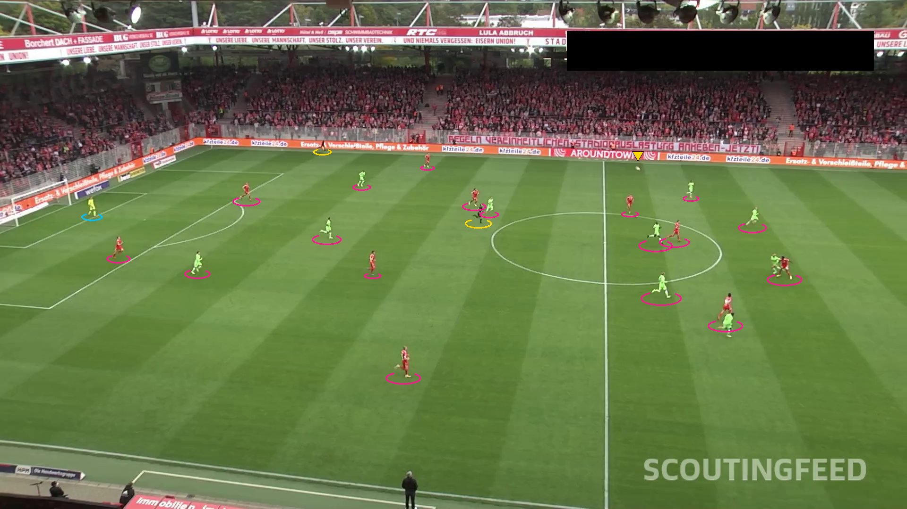

# Interpreting Player Dynamics with Computer Vision for Tactical Soccer Analysis
Using computer vision and machine learning techniques, including Roboflow Inference, Supervision, Torch, Transformers (SigLIP), OpenCV, UMAP, scikit-learn and NVIDIA’s GPU stack where available, to detect and track football players, referees, goalkeepers, and the ball, then project them onto a 2D tactical pitch view.


## Overview and Background
Analyzing football matches automatically involves several challenging subtasks: locating all players, referees and the ball in broadcast footage, deciding which team each player belongs to, understanding the geometry of the pitch from the camera view, and finally transforming everything into useful tactical information. In this project, we build a modular Football AI system that chains together object detection, multi-object tracking, team-color clustering and pitch keypoint detection to create a “video-game style” representation of a real match. Roboflow detection models are used to find balls, players, goalkeepers and referees frame-by-frame; Supervision and ByteTrack maintain consistent identities over time, while a dedicated field model extracts keypoints that define the pitch layout from the camera perspective.

On top of these detections, we leverage a SigLIP-based embedding model together with UMAP and KMeans (and a higher-level TeamClassifier wrapper) to cluster players by jersey color and automatically split them into two teams. Using homography (via a ViewTransformer) between the camera plane and an idealized soccer pitch, all entities are projected into metric pitch coordinates. This enables the creation of radar-style tactical views, Voronoi control maps, and smoothed ball trajectories in 2D, giving coaches and analysts an interpretable, data-driven view of positioning, space control and ball movement derived directly from raw match video.


## Table of Contents
```
football-players-tracking
|__ images
|   |__ ball_path.png 
|   |__ boxes_with_labels.png
|   |__ radar_view.png
|   |__ stylized_view.png
|   |__ tracked_view.png
|   |__ voronoi_basic.png
|   |__ voronoi_blend.png
|__ src
    |__ __init__.py
    |__ ball_tracking.py
    |__ config.py
    |__ detection.py
    |__ models.py
    |__ pitch.py
    |__ project_secrets.py
    |__ run_demos.py
    |__ team_clustering.py
    |__ tracking.py
    |__ video_io.py
|__ videos
|   |__ 0bfacc_0.mp4
|   |__ 2e57b9_0.mp4
|   |__ 08fd33_0.mp4
|   |__ 573e61_0.mp4
|   |__ 121364_0.mp4
README.md
requirements.txt
LICENSE
```

## Getting started

### Resources used
A high-performance Acer Nitro 5 laptop, powered by an Intel Core i7 processor and an NVIDIA GeForce GTX 1650 GPU (4 GB VRAM), was used for model training and evaluation. Due to the large size of the dataset, the training process was computationally demanding and prolonged. Nevertheless, this hardware configuration provided a stable and efficient environment, enabling consistent experimentation and reliable validation of the gesture-recognition models.

### Installing
The project is deployed in a local machine, so you need to install the next software and dependencies to start working:

1. Create and activate the new virtual environment for the project

```bash
conda create --name football_ai python=3.11
conda activate football_ai
```

2. Clone repository

```bash
git clone https://github.com/rafamartinezquiles/football-players-tracking.git
```

3. In the same folder that the requirements are, install the necessary requirements

```bash
cd football-players-tracking
pip install -r requirements.txt
```

4. In addition to installing the required packages, you must set up the API keys needed to access HuggingFace models and Roboflow. Create an account on each platform and generate your API keys. Note: for HuggingFace, a read-only token is sufficient. Once you have both keys, set them in your environment. On Windows (Command Prompt), run:

```bash
set HF_TOKEN=api_key
set ROBOFLOW_API_KEY=api_key
```

### Execution
From the project root (folder containing src/), execute:

```bash
python src/run_demos.py
```

The script automatically executes three demos in sequence: single-frame detection, radar and Voronoi analysis, and ball trajectory extraction. If needed, any of these demos can be disabled by commenting them out at the bottom of run_demos.py, allowing you to run them individually during debugging or development.

During execution, the first stage—single-frame detection—starts with a call to init_roboflow_models(), which loads both the player/ball/referee detection model and the pitch keypoint model. The system then reads the first video frame from SOURCE_VIDEO_PATH using Supervision’s efficient frame generator. That frame is passed to detection.run_player_detection_on_frame, which performs inference and converts the raw Roboflow response into a standardized Detections object. Annotation utilities such as create_box_and_label_annotators and annotate_frame_with_boxes overlay bounding boxes and class/confidence labels on detected players, goalkeepers, referees and the ball. A second visualization, generated by stylized_frame_view, provides a “video-game style” representation, replacing bounding boxes with colored ellipses and a triangular pointer for the ball. When the stage completes, two images appear in your project root: boxes_with_labels.png, showing the standard annotated frame, and stylized_view.png, showing the stylized version.


