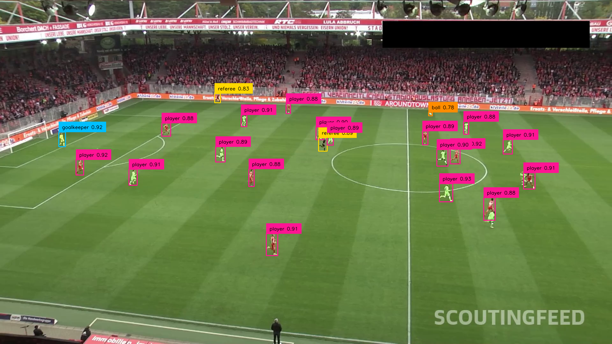
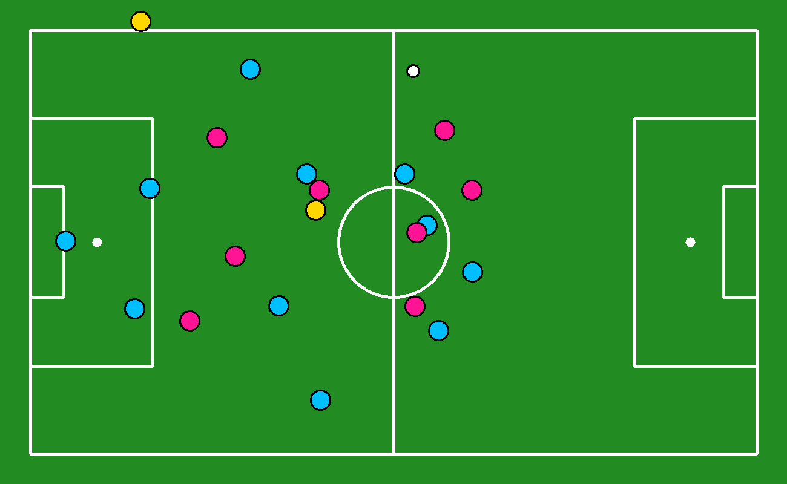

# Interpreting Player Dynamics with Computer Vision for Tactical Soccer Analysis
Using computer vision and machine learning techniques, including Roboflow Inference, Supervision, Torch, Transformers (SigLIP), OpenCV, UMAP, scikit-learn and NVIDIA’s GPU stack where available, to detect and track football players, referees, goalkeepers, and the ball, then project them onto a 2D tactical pitch view.

## Overview and Background
Analyzing football matches automatically involves several challenging subtasks: locating all players, referees and the ball in broadcast footage, deciding which team each player belongs to, understanding the geometry of the pitch from the camera view, and finally transforming everything into useful tactical information. In this project, we build a modular Football AI system that chains together object detection, multi-object tracking, team-color clustering and pitch keypoint detection to create a “video-game style” representation of a real match. Roboflow detection models are used to find balls, players, goalkeepers and referees frame-by-frame; Supervision and ByteTrack maintain consistent identities over time, while a dedicated field model extracts keypoints that define the pitch layout from the camera perspective.

On top of these detections, we leverage a SigLIP-based embedding model together with UMAP and KMeans (and a higher-level TeamClassifier wrapper) to cluster players by jersey color and automatically split them into two teams. Using homography (via a ViewTransformer) between the camera plane and an idealized soccer pitch, all entities are projected into metric pitch coordinates. This enables the creation of radar-style tactical views, Voronoi control maps, and smoothed ball trajectories in 2D, giving coaches and analysts an interpretable, data-driven view of positioning, space control and ball movement derived directly from raw match video.

